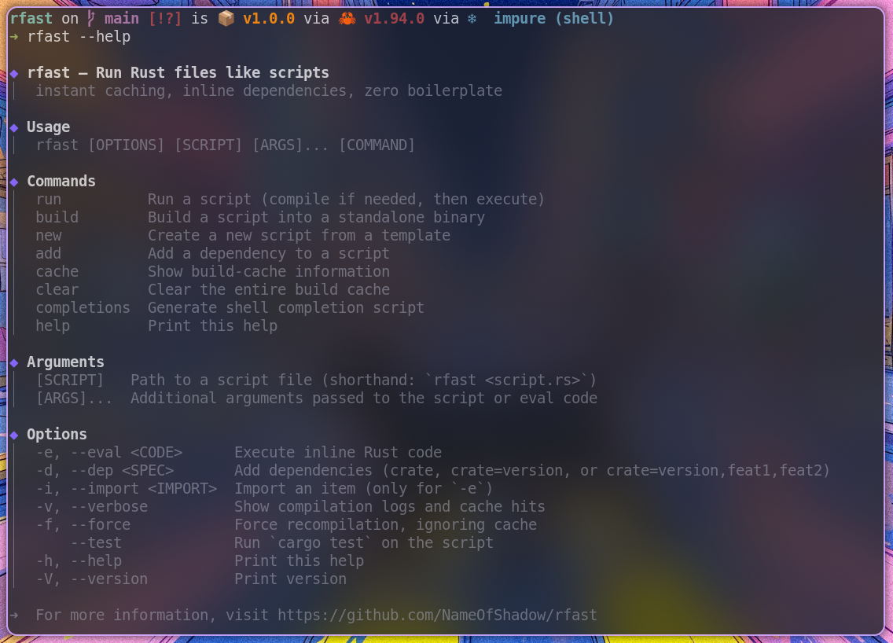

# rfast

[](https://crates.io/crates/rfast)
[](https://opensource.org/licenses/MIT)
[](https://www.rust-lang.org)

**Run Rust files like scripts — instant caching, zero boilerplate, full dependency support.**

`rfast` turns Rust into a scripting language. Write a `.rs` file, run it – no `cargo new`, no `Cargo.toml`, no waiting. Dependencies? Just declare them in a comment. One‑liners? `rfast -e 'println!("Hello")'` – with external crates and automatic caching. Perfect for quick scripts, build tools, data pipelines, and trying out libraries.

## 🎬 Demo



## ✨ Features

- **Zero‑boilerplate scripts** – a single `.rs` file with `fn main()` is enough.
- **Inline dependencies** – declare crates inside `/* [dependencies] */` or `//!` lines.
- **Instant evaluation** – `rfast -e '...'` compiles and caches by source + deps + imports. Re‑runs are instant.
- **Dependency injection** – add a crate to any script with `rfast -d serde script.rs`.
- **Features in dependencies** – specify features directly: `-d tokio=1.0,full,rt`.
- **Test your scripts** – `rfast --test script.rs` runs `cargo test` inside the script.
- **Force recompilation** – `rfast --force run script.rs` ignores cache and rebuilds.
- **Quiet by default** – only your program’s output goes to stdout. Perfect for pipes. Use `-v` to see compilation logs.
- **Smart caching** – binaries are stored in `~/.cache/rfast/` keyed by content hash. Cache never gets stale.
- **Cross‑platform** – Linux, macOS, Windows (with `.bat` launchers).
- **Shell completions** – generate for `bash`, `zsh`, `fish`, `powershell`.

## 📦 Installation

```bash
cargo install rfast
```

Or build from source:

```bash
git clone https://github.com/NameOfShadow/rfast.git
cd rfast
cargo install --path .
```

## 🚀 Quick Start

### 1. Run a simple script

Create `hello.rs`:

```rust
fn main() {
    println!("Hello, world!");
}
```

```bash
rfast hello.rs
# Hello, world!
```

### 2. Add a dependency

Inside your script, use a metadata block:

```rust
/*
[dependencies]
colored = "3.1"
*/

use colored::Colorize;

fn main() {
    println!("{}", "Hello".red());
}
```

Run it – `rfast` automatically compiles, caches, and runs.

### 3. One‑liners with `-e`

No file needed:

```bash
rfast -e 'println!("Hello from eval!");'
```

With external dependencies and imports:

```bash
rfast -e 'use colored::Colorize; println!("{}", "Magic".red());' -d colored -i colored::Colorize
```

The first run compiles (2‑3 seconds), subsequent runs are instant.

### 4. Add a dependency to an existing script

```bash
rfast -d serde my_script.rs
```

This injects `serde = "*"` into the script’s metadata block.

### 5. Create a new script from a template

```bash
rfast new myscript
```

Generates a ready‑to‑use script with a dependency placeholder.

### 6. Run tests inside a script

Create `test_script.rs`:

```rust
//! [dependencies]

fn main() {
    println!("Running main");
}

#[test]
fn it_works() {
    assert_eq!(2 + 2, 4);
}
```

```bash
rfast --test test_script.rs
```

### 7. Force recompilation

```bash
rfast --force run my_script.rs   # rebuild even if cache is fresh
```

## 📋 Command Reference

```
rfast [OPTIONS] [SCRIPT] [ARGS]... [COMMAND]
```

### Global Options

| Flag | Description |
|------|-------------|
| `-e`, `--eval <CODE>` | Execute inline Rust code. |
| `-d`, `--dep <SPEC>` | Add a dependency. Format: `crate`, `crate=version`, or `crate=version,feat1,feat2`. |
| `-i`, `--import <IMPORT>` | Import an item (e.g., `-i colored::Colorize`). Only for `-e`. |
| `-v`, `--verbose` | Show compilation logs and cache hits. |
| `--force` | Force recompilation, ignoring cache. |
| `--test` | Run `cargo test` on the script instead of executing it. |
| `-h`, `--help` | Print help. |
| `-V`, `--version` | Print version. |

### Commands

| Command | Description |
|---------|-------------|
| `run <script.rs> [args...]` | Run a script (default if no command given). Supports `--force` flag. |
| `build <script.rs> [--output <path>] [--release]` | Build a standalone binary. |
| `new <file.rs>` | Create a new script from template. |
| `add <crate> <script.rs> [--version <ver>]` | Add a dependency to a script. |
| `cache` | Show cache info (location, size, entries). |
| `clear` | Clear the entire build cache. |
| `completions <shell>` | Generate shell completion script. |

## 💡 Examples

### Use in a pipeline (quiet mode)

```bash
cat data.txt | rfast -e '
use std::io::Read;
let mut s = String::new();
std::io::stdin().read_to_string(&mut s).unwrap();
println!("Lines: {}", s.lines().count());
'
```

### Pretty‑print JSON

```bash
curl -s https://api.github.com/repos/rust-lang/rust | rfast -e '
use serde_json::Value;
let input = std::io::stdin().lines().collect::<Result<String, _>>().unwrap();
let v: Value = serde_json::from_str(&input).unwrap();
println!("{}", serde_json::to_string_pretty(&v).unwrap());
' -d serde_json
```

### Use a specific version of a crate with features

```bash
rfast -e 'use regex::Regex; let re = Regex::new(r"\d+").unwrap(); println!("{:?}", re.find("a1b"));' -d regex=1.10,perf
```

### Build a release binary

```bash
rfast build my_script.rs --output ./myapp --release
```

### Force rebuild and see verbose output

```bash
rfast -v --force run my_script.rs
```

### Run tests with custom arguments

```bash
rfast --test my_script.rs -- --nocapture
```

## ⚙️ Shell Completions

Generate and install completions:

```bash
# Bash
rfast completions bash > ~/.local/share/bash-completion/completions/rfast
source ~/.bashrc

# Zsh
rfast completions zsh > ~/.zfunc/_rfast
# add to ~/.zshrc: fpath+=~/.zfunc; autoload -U compinit && compinit

# Fish
rfast completions fish > ~/.config/fish/completions/rfast.fish
```

## 🧠 How It Works

### Script execution
`rfast` hashes the script content (SHA‑256). It creates a temporary Cargo project under `~/.cache/rfast/<hash>/`, writes a `Cargo.toml` with the declared dependencies, and compiles the script. The binary is cached. Subsequent runs check the stamp file and execute the binary instantly.

### Eval mode
The source code, dependencies (`-d`), and imports (`-i`) are combined into a hash. The resulting binary is stored under `~/.cache/rfast/eval/<hash>/`. Same code → instant re‑run.

### Dependency injection
`rfast -d crate script.rs` finds the `/* [dependencies] */` block (or creates one) and appends `crate = "*"`. Works with both block and line‑comment metadata.

### Features in dependencies
When you write `-d tokio=1.0,full,rt`, `rfast` translates it into `tokio = { version = "1.0", features = ["full", "rt"] }` in the generated `Cargo.toml`.

### Testing mode
`rfast --test script.rs` compiles the script (if needed) and runs `cargo test` inside its project directory, forwarding any extra arguments after `--` to `cargo test`.

## 🗑️ Cache Management

View cache:

```bash
rfast cache
```

Clear cache:

```bash
rfast clear
```

## 🔄 Compatibility with other script runners

`rfast` understands the dependency syntax of popular Rust script runners, so you can run existing scripts without changes:

| Tool | Syntax example | Supported |
|------|----------------|-----------|
| **cargo-script** | `//! ```cargo` block or `// cargo-deps: time="0.1.25"` | ✅ |
| **cargo-eval** | Same as cargo-script (identical format) | ✅ |
| **cargo-play** | `//# serde_json = "*"` | ✅ |
| **rust-script** | `/* [dependencies] */` block | ✅ |
| **rfast native** | `//! [dependencies]` line comments | ✅ |

All these formats are detected automatically. You can also mix them – `rfast` will find the first valid metadata block.

**Examples:**

```rust
// cargo-script style
// cargo-deps: time="0.1.25"

// cargo-play style
//# serde_json = "*"

// rfast style (block comment)
/*
[dependencies]
colored = "3.1"
*/
```

Run any of them with `rfast script.rs` – no migration needed.

## 🧩 Comparison with similar tools

| Tool | Description | rfast advantage |
|------|-------------|-----------------|
| `cargo-script` | Runs Rust scripts with dependencies. | `rfast` caches binaries, has instant `-e` with deps, and quieter default. |
| `rust-script` | Similar to cargo-script. | `rfast` offers built‑in `-e` with dependency caching and automatic import injection. |
| `cargo-eval` | One‑liner evaluator. | `rfast -e` caches the result, supports multiple dependencies via `-d`, and works in pipelines without noise. |

## 🤝 Contributing

Contributions are welcome! Please open an issue or pull request on [GitHub](https://github.com/NameOfShadow/rfast).

## 📄 License

MIT © [NameOfShadow](https://github.com/NameOfShadow)

---

**rfast – Rust scripting, finally friction‑free.**